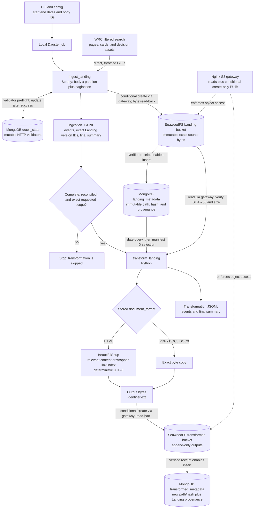

# Architecture

## Pipeline

`kedra orchestrate` runs two local Dagster ops; the same stage boundaries are available as
standalone CLI commands. MongoDB, SeaweedFS, and the Nginx S3 gateway run in Docker.

## Date partitions

Calendar months are the default because WRC accepts inclusive date filters and expected
volume is modest. The first and last months are clipped to the requested bounds, while
`partition_date` stays at the calendar month start so overlapping reruns keep a stable label.
Daily partitions remain configurable for dense or repeatedly failing periods. Every body is
queried separately; advertised totals must reconcile with every page and card.

## Retries and rate limiting

Scrapy exposes configurable per-domain concurrency, delay, timeouts, response size, retry
count, and an honest user-agent. AutoThrottle stays inside the concurrency limit. A shared
origin cooldown honors `Retry-After`; otherwise it uses randomized exponential backoff.
Zero-byte 200 responses and 408, 500, 502, 503, 504, 522, or 524 failures receive bounded
retries. Permanent content, format, integrity, and pagination failures make the run incomplete
instead of truncating it.

## Deduplication and recovery

A logical record key uses source, body, and reference number, with a canonical-URL fallback;
conflicting metadata is an identity collision. A Landing version combines that record,
asset identity, stable metadata hash, detected format, and SHA-256 of the exact bytes.
Deterministic, create-only object writes are read back before create-only Mongo metadata is
inserted, so retry can reuse an object left by an interrupted metadata write. Transformed
versions also include the Landing version and transform version. Neither zone overwrites or
deletes objects or metadata.

Server `ETag` or `Last-Modified` values enable conditional requests and verified 304 reuse;
the validators live in mutable `crawl_state`, outside Landing. Sampled HTML supplied neither
validator, so the freshness-first policy must fetch it before a local hash can prove equality.
The literal no-redownload guarantee is therefore not met for validator-free HTML without
accepting stale-cache risk or obtaining a trustworthy upstream change signal.

## Supporting 50+ sources

Keep these storage/version contracts and add one adapter per source search, metadata, and
document layout. Schedule durable source/partition units, enforce a global host rate budget,
isolate retries/checkpoints, and stream indexed metadata in bounded batches. At scale, use
managed replicated storage, queues, autoscaled workers, monitoring, backups, and schema or
transform migrations. Cross-source entity matching belongs in a separate derived stage so it
cannot weaken raw provenance or Landing immutability.
